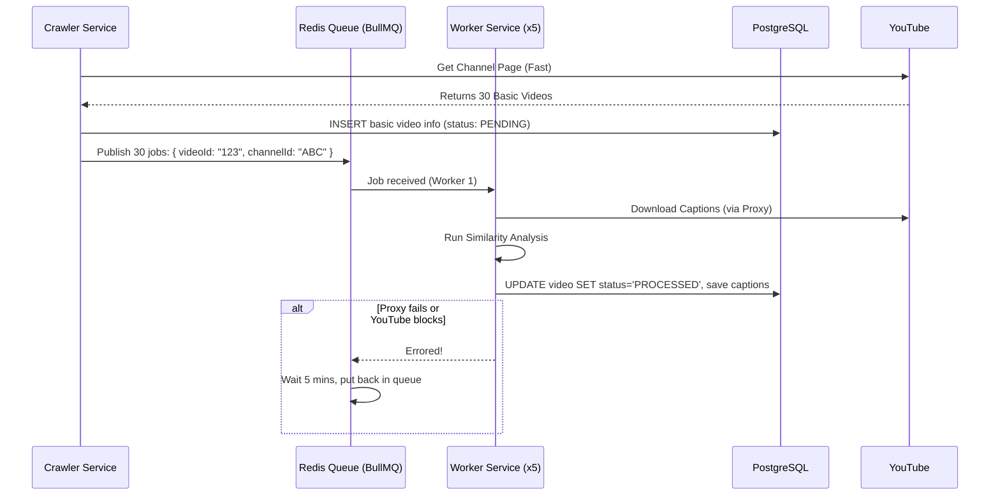

# YouTube Scraper Microservices Architecture

When dealing with a massive scraping operation (potentially millions of channels and billions of videos), moving from a single monolithic script to a distributed, microservices-oriented architecture is essential for scalability, error recovery, and IP rotation.

Here is a comprehensive breakdown of how to structure this system.

---

## 1. Core Services Breakdown

Instead of one massive application, split the system into distinct services based on their responsibilities.

### **Service 1: Channel Discovery & Sync (The "Crawler")**
* **Responsibility:** Finds new channels, or iterates over existing channels to find new videos.
* **Action:** Fetches the channel page or uses the search API. 
* **Output:** Extracts basic video info (ID, Title, Channel ID) and immediately pushes a `PROCESS_VIDEO_COMMAND` to a message queue. It does *not* do heavy processing. 

### **Service 2: Video Processing Worker (The "Heavy Lifter")**
* **Responsibility:** Listens to the queue. For each video, it fetches the actual video details, downloads manual/auto captions, runs the similarity algorithm, and determines the final caption status.
* **Action:** This is the service that needs proxy rotation (like 3proxy IPv6 subnets) to avoid getting blocked by YouTube, because it makes the most requests.
* **Output:** Updates the database with the final processed video data.

### **Service 3: API / Dashboard (The "Interface")**
* **Responsibility:** Serves the backend API for your frontend dashboard.
* **Action:** Queries the database to show you stats, errors, processing speed, and allows you to trigger manual scrapes.

---

## 2. Communication: gRPC vs Queues vs Database Polling

When connecting the Crawler to the Workers, you have three main options: gRPC, Database Polling, and Message Queues. **Message Queues (like BullMQ, RabbitMQ) are the industry standard for this type of system.**

### Why Not gRPC/REST?
gRPC is synchronous. If Service 1 calls Service 2 via gRPC to process a video, Service 1 has to wait for Service 2 to finish. If Service 2 takes 5 seconds (downloading captions, analyzing), Service 1 is blocked. If Service 2 crashes, the request fails.

### Why Not Database Polling (Workers pull from DB)?
You *can* have workers run a query like `SELECT * FROM videos WHERE status = 'PENDING' LIMIT 10`, but this creates several massive problems at scale:

1.  **Concurrency Issues (The "Double Process" Problem):** 
    If you have 5 workers all running `SELECT LIMIT 10` at the exact same time, they will all grab the *exact same 10 videos* and process them simultaneously. You end up making 5x the requests to YouTube for no reason and overwriting data.
    To fix this, you have to use complex database locks (like PostgreSQL's `FOR UPDATE SKIP LOCKED`). While possible, it puts immense strain on your database CPU.
2.  **Database Overload (The Polling Tax):**
    If the queue is empty, your 5 workers are just constantly pinging the database every second: "Got anything? No. Got anything? No." This wastes database connections and resources. Queues use a "push" model—workers sleep until the queue wakes them up with new work.
3.  **No Built-in Retries or Dead-Lettering:**
    If a proxy times out during a video download, what happens? In a polling system, you have to write complex database logic: update the status to 'ERROR', increment a `retry_count` column, and write a *new* query that looks for `last_attempt_at < NOW() - 5 minutes`. 
    Message queues (like BullMQ) handle all of this automatically (exponential backoff, dead-letter queues, rate limits) out of the box.

### How Many Queues Do You Need?

A common mistake is creating one queue per channel (e.g., 100,000 channels = 100,000 queues). **Do not do this.** Message brokers like Redis or RabbitMQ are not designed to have hundreds of thousands of individual queues. 

You should design your system around **Work Types**, not data entities. You only need **two or three main queues, total, for the entire system.**

1.  **`channels-sync` Queue:**
    *   **Jobs inside:** `ChannelID` string.
    *   **What it does:** The Crawler picks up jobs here: "Go to channel ABC, find all new videos, save their basic info to the DB, and push their VideoIDs to the next queue."
    *   **Concurrency:** Keep concurrency low (e.g., 5-10 workers) so you don't rapid-fire hit YouTube's channel pages from the same IP.

2.  **`video-processing` Queue:**
    *   **Jobs inside:** `VideoID` string.
    *   **What it does:** The Worker picks up jobs here: "Go download captions for video XYZ, run the similarity algorithm, and update the database."
    *   **Concurrency:** This is the massive queue. It will contain millions of jobs. You scale this up to 50, 100, or 500 parallel workers across multiple machines (using your proxy rotation) to chew through the backlog.

Optional Advanced Queue:
3.  **`proxy-health` Queue:**
    *   **What it does:** Periodically checks if your rotating proxies in your pool are still alive, and removes dead ones.

## 4. Handling Crawler Errors and Pagination (The "Cursor" Method)

A major concern is what happens when fetching a massive channel (e.g., 50,000 videos) and the scraper crashes or gets blocked halfway through.

If you fetched 1,000 videos, scheduled them to the `video-processing` queue, and on video 1,001 you get an error (e.g., YouTube throws a 429 Too Many Requests), how do you recover?

**Do NOT start from the beginning next time.** You must use **Pagination Cursors (Continuation Tokens).**

1.  **The Crawler Job starts:** It hits YouTube to get the first page of 30 videos.
2.  **Save the cursor:** YouTube returns a `next_page_token` (or `continuation` string). 
3.  **Process the page:** The crawler inserts the 30 basic videos into the database and pushes 30 jobs to the `video-processing` queue.
4.  **Save state:** The crawler immediately updates the `channels` table in the database: `UPDATE channels SET last_cursor = 'token_abc123' WHERE channel_id = 'ABC'`.
5.  **Next page:** It uses `token_abc123` to fetch the next 30 videos.

**When the error happens right after video 1,000:**
1.  The Crawler worker throws an error (e.g., "HTTP 429").
2.  The `channels-sync` Queue automatically marks this channel job as "Failed" and schedules it for a retry in 15 minutes.
3.  15 minutes later, a worker picks up the channel job again.
4.  **Crucial Step:** Before making a request, it checks the database: `SELECT last_cursor FROM channels WHERE channel_id = 'ABC'`.
5.  It sees the saved cursor. Instead of asking YouTube for the *newest* videos, it asks YouTube for the *next page* using that exact cursor.
6.  The crawler seamlessly picks up precisely at video 1,001.

Those first 1,000 videos? They are happily sitting in the `video-processing` queue being worked on by your other services. You didn't lose any progress.

You manage priority and fairness *inside* the single `video-processing` queue (e.g., BullMQ has advanced features for this), rather than creating separate queues for every single channel.

**Recommendation:** For Node.js/TypeScript, use **BullMQ** (backed by Redis) or **RabbitMQ**.

---

## 3. Database Strategy: Shared vs. Per-Service

The strict microservice "rule" is **Database-per-Service** (each service has its own completely separate DB, and they sync via events). However, for a small team building a scraping pipeline, this is often over-engineering and creates a nightmare of data consistency.

### The Pragmatic Approach: Shared Database with Bounded Contexts
Use one large database (e.g., PostgreSQL), but logically split the tables, and restrict which services can write to which tables.

*   `channels`, `videos`, `captions` tables.
*   **Crawler Service:** Has **Read/Write** access to `channels` (updating last scraped time) and **Insert-Only** access to `videos` (inserting basic info).
*   **Processor Service:** Has **Read/Write** access to `videos` (updating the `caption_status` and processing flags) and `captions` (saving the text).
*   **API Service:** Primarily **Read-Only** across all tables to serve the dashboard.

### If you absolutely want Database-per-Service:
1.  **Crawler DB:** Stores `Channels` (last scraped token, status) and a local `DiscoveredVideos` table.
2.  **Processor DB:** Stores `ProcessedVideos` and `Captions`.
When the Crawler finds a video, it sends a message to the Queue. The Processor picks it up, processes it, and saves it in its own Database. The API has to query the Processor DB to get the final data. 

**Recommendation:** Stick to a **Shared PostgreSQL Database** until your database literally cannot handle the read/write load (which takes billions of rows and heavy traffic). Separate the *compute* (workers), keep the *state* (database) unified for now.

---

## 4. Recommended Infrastructure Stack

*   **Language:** TypeScript / Node.js
*   **Database:** PostgreSQL (Handles relational data, JSONB for raw youtube dumps, and scales very well).
*   **Message Broker (Queue):** Redis + BullMQ (Very easy in TS) OR RabbitMQ.
*   **Caching:** Redis (Store proxy lists, rate limit counters, temporary tokens).
*   **Deployment:** Docker Compose (local) or Kubernetes/AWS ECS (production). Have 1 container for Crawler, and scale the Processor container to N instances depending on proxy availability.

---

## 5. Flow Diagram

